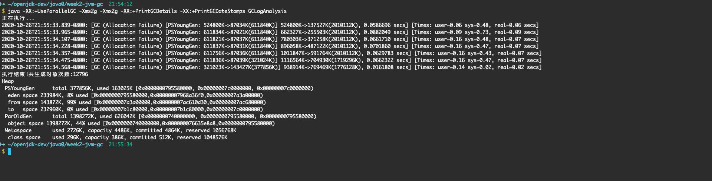

# JVM调优分析笔记

---

## 目录
#### <a href="#7">点击查看JVM调优分析总结作业</a>
代码作业为当前目录的 http-client
#### <a href="#1">一、准备工作</a>
- <a href="#1.1">1. Mac 安装wrk</a>
- <a href="#1.2">2. 编译GCLogAnalysis.java(为方便操作移除了包名)</a>
#### <a href="#2">二、GC 日志解读与分析</a>
- <a href="#2.1">1. 简单示例</a>
- <a href="#2.2">2. 模拟一下 OOM</a>
- <a href="#2.3">3. 分别使用512m、1024m、2048m、4096m堆内存观察 GC 信息的不同</a>
- <a href="#2.4">4. 串行GC 日志解读与分析</a>
- <a href="#2.5">5. 并行GC 日志解读与分析</a>
- <a href="#2.6">6. CMS GC 日志解读与分析</a>
- <a href="#2.7">7. G1 GC 日志解读与分析</a>
- <a href="#2.8">8. [扩展练习]通过jdk15观察ZGC和ShenandoahGC的情况</a>
#### <a href="#3">三、JVM 线程堆栈数据分析</a>
- <a href="#3.1">1. JVM 线程堆栈数据分析工具</a>
#### <a href="#4">四、内存分析与相关工具</a>
#### <a href="#5">五、JVM 问题分析调优经验</a>
#### <a href="#6">六、GC 疑难情况问题分析</a>
- <a href="#6.1">1. arthas常见案例分析</a>

---

## <a id="1">一、准备工作</a>
```
# 操作系统
MacOSX 10.15.7 16CPU 32G
# jdk
JDK1.8.0_231
# 用于分析的java类
ref_files/GCLogAnalysis.java(utf-8编码的文件)
# http压测工具
wrk
# 测试用spring boot应用 http://localhost:8088/api/hello
ref_files/gateway-server-0.0.1-SNAPSHOT.jar
```
### <a id="1.1">1. Mac 安装wrk</a>
```bash
1.执行brew install wrk
如果显式brew update很慢，可以ctrl+C打断更新
2.输入 wrk
执行 wrk -t8 -c40 -d60s http://localhost:8088/api/hello
```
### <a id="1.2">2. 编译GCLogAnalysis.java(为方便操作移除了包名)</a>
```bash
# 编译
javac -g GCLogAnalysis.java
# 查看字节码
javap -v GCLogAnalysis
# 执行代码
java GCLogAnalysis
```

## <a id="2">二、GC 日志解读与分析</a>
```
# GC Tool
https://gceasy.io/
## https://www.tagtraum.com/gcviewer.html的分支
https://github.com/chewiebug/GCViewer
https://perfma.com/product/community
```


### <a id="2.1">1. 简单示例</a>
```bash
# 打印GC详情
java -XX:+PrintGCDetails GCLogAnalysis
# 将GC日志保存至文件中
java -Xloggc:gc.demo.log -XX:+PrintGCDetails -XX:+PrintGCDateStamps GCLogAnalysis
# 查看文件中的GC日志
less gc.demo.log
```


### <a id="2.2">2. 模拟一下 OOM</a>
```bash
# 模拟一下 OOM
java -Xmx128m -XX:+PrintGCDetails GCLogAnalysis
```


### <a id="2.3">3. 分别使用512m、1024m、2048m、4096m堆内存观察 GC 信息的不同</a>
```bash
# -Xms512m -Xmx512m
java -Xms512m -Xmx512m -XX:+PrintGCDetails GCLogAnalysis
# -Xms1024m -Xmx1024m 或 -Xms1g -Xmx1g
java -Xms1g -Xmx1g -XX:+PrintGCDetails GCLogAnalysis
# -Xms2048m -Xmx2048m 或 -Xms2g -Xmx2g
java -Xms2g -Xmx2g -XX:+PrintGCDetails GCLogAnalysis
# -Xms4096m -Xmx4096m 或 -Xms4g -Xmx4g
java -Xms4g -Xmx4g -XX:+PrintGCDetails GCLogAnalysis
```


### <a id="2.4">4. 串行GC 日志解读与分析</a>
```bash
# 在gc.demo.log中观察 Young GC 与 Full GC
java -XX:+UseSerialGC -Xms512m -Xmx512m -Xloggc:gc.demo.log -XX:+PrintGCDetails -XX:+PrintGCDateStamps GCLogAnalysis
# 控制台直接输出日志查看
java -XX:+UseSerialGC -Xms512m -Xmx512m -XX:+PrintGCDetails -XX:+PrintGCDateStamps GCLogAnalysis
```


### <a id="2.5">5. 并行GC 日志解读与分析</a>
```bash
# 在gc.demo.log中观察 Young GC 与 Full GC
java -XX:+UseParallelGC -Xms512m -Xmx512m -Xloggc:gc.demo.log -XX:+PrintGCDetails -XX:+PrintGCDateStamps GCLogAnalysis
# 控制台直接输出日志查看
java -XX:+UseParallelGC -Xms512m -Xmx512m -XX:+PrintGCDetails -XX:+PrintGCDateStamps GCLogAnalysis
# 思考：如果不配置 Xms 会怎么样？
java -XX:+UseParallelGC -Xmx512m -Xloggc:gc.demo.log -XX:+PrintGCDetails -XX:+PrintGCDateStamps GCLogAnalysis
```




### <a id="2.6">6. CMS GC 日志解读与分析</a>
```bash
# 在gc.demo.log中观察 Young GC 与 Full GC
java -XX:+UseConcMarkSweepGC -Xms512m -Xmx512m -Xloggc:gc.demo.log -XX:+PrintGCDetails -XX:+PrintGCDateStamps GCLogAnalysis
# 控制台直接输出日志查看
java -XX:+UseConcMarkSweepGC -Xms512m -Xmx512m -XX:+PrintGCDetails -XX:+PrintGCDateStamps GCLogAnalysis
# 思考：假如 Xmx/Xms 设置 4g 会怎么样？
java -XX:+UseConcMarkSweepGC -Xms4g -Xmx4g -Xloggc:gc.demo.log -XX:+PrintGCDetails -XX:+PrintGCDateStamps GCLogAnalysis
# 4g 内存下跟并行 gc 相比呢？
java -XX:+UseG1GC -Xms4g -Xmx4g -Xloggc:gc.demo.log -XX:+PrintGCDetails -XX:+PrintGCDateStamps GCLogAnalysis
```


### <a id="2.7">7. G1 GC 日志解读与分析</a>
```bash
# 在gc.demo.log中观察 Young GC 与 Full GC
java -XX:+UseG1GC -Xms512m -Xmx512m -Xloggc:gc.demo.log -XX:+PrintGCDetails -XX:+PrintGCDateStamps GCLogAnalysis
# 控制台直接输出日志查看 -XX:+PrintGC
java -XX:+UseG1GC -Xms512m -Xmx512m -XX:+PrintGC -XX:+PrintGCDateStamps GCLogAnalysis
java -XX:+UseG1GC -Xms4g -Xmx4g -XX:+PrintGC -XX:+PrintGCDateStamps GCLogAnalysis
# 思考：假如 Xmx/Xms 设置 4g 会怎么样？
java -XX:+UseG1GC -Xms4g -Xmx4g -Xloggc:gc.demo.log -XX:+PrintGCDetails -XX:+PrintGCDateStamps GCLogAnalysis
# 4g 内存下跟 cms gc 相比呢？
java -XX:+UseConcMarkSweepGC -Xms4g -Xmx4g -Xloggc:gc.demo.log -XX:+PrintGCDetails -XX:+PrintGCDateStamps GCLogAnalysis
```


### <a id="2.8">8. [扩展练习]通过jdk15观察ZGC和ShenandoahGC的情况</a>
```bash
# 控制台直接输出日志查看 -XX:+PrintGC
java -XX:+UseZGC -Xms512m -Xmx512m -XX:+PrintGC GCLogAnalysis
java -XX:+UseZGC -Xms4g -Xmx4g -XX:+PrintGC GCLogAnalysis
java -XX:+UseZGC -Xms8g -Xmx8g -XX:+PrintGC GCLogAnalysis
```


### 总结：
    1. 如何查看/分析不同 GC 配置下的日志信息？
    答：通过-Xloggc:gc.demo.log -XX:+PrintGCDetails -XX:+PrintGCDateStamps参数输出GC详情。
    最好是通过日志分析工具查看比较直观。

    2. 各种 GC 有什么特点和使用场景？
    答：串行GC尽量不要用,高吞吐考虑并行GC,低延迟考虑CMS GC,如果内存较大考虑G1 GC.
    进一步考虑到低延迟可以考虑新型的ZGC，linux系统上jdk11开始实验支持。
    oracle jdk不支持-XX:+UseShenandoahGC,openjdk15可以。

## <a id="3">三、JVM 线程堆栈数据分析</a>
```
# Java Thread Dump Analyzer
https://fastthread.io/
```


### <a id="3.1">1. JVM 线程堆栈数据分析工具</a>
```bash
jconsole
jvisualvm
jmc
```

## <a id="4">四、内存分析与相关工具</a>
```
# 请思考一个问题：
一个对象具有100个属性，与100个对象每个具有1个属性，哪个占用的内存空间更大？
答：100个对象每个具有1个属性的大。 64位对象头占用12字节。

# 堆溢出
OutOfMemoryError: Java heap space

# 内存 Dump 分析工具
• Eclipse MAT
• jhat
```

## <a id="5">五、JVM 问题分析调优经验</a>
```
需要今后多实践...
```

## <a id="6">六、 GC 疑难情况问题分析</a>
```
# Java Diagnostic Tool
https://arthas.aliyun.com/zh-cn/
```
### <a id="6.1">1. arthas常见案例分析</a>
```bash
需要今后多实践...
```

## <a id="7">===JVM调优分析总结===</a>
```
# 1. 增大堆内存大小可以减少GC的次数，减小OOM发生的概率。
单位时间内可以创建更多的对象。
# 2. 不配置 Xms的话第一次GC时间会提前。如果知道使用多少内存，Xms和Xmx尽量设成一样的。
# 3. java程序一般比较耗费内存,选择java应用服务器的时候尽量选择内存4g以上的会好些。
# 4. 内存如果过小，各类GC都表现不佳。
# 5. 年轻代to区放不下会放到老年代,年轻代经历多代之后依然存活就会进入老年代。
# 6. 串行GC尽量不要用,高吞吐考虑并行GC,低延迟考虑CMS GC,如果内存较大考虑G1 GC。
```